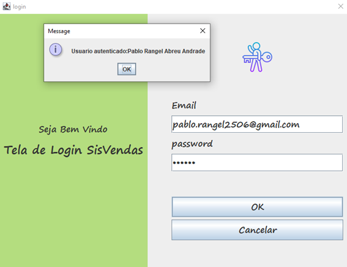
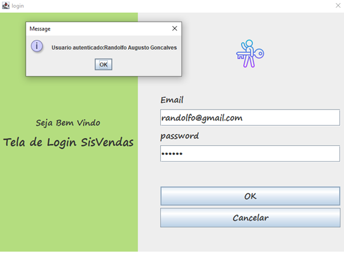
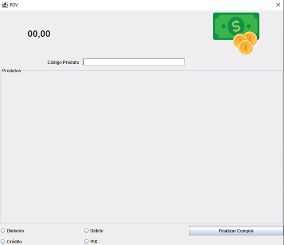
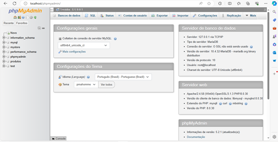
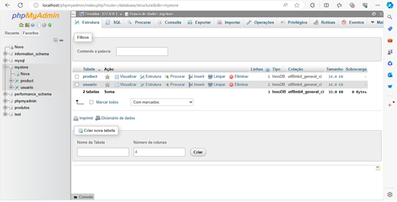
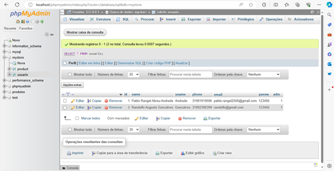
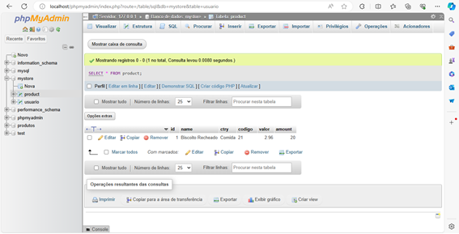

# SisVendas

 
<h>A tela de login do nosso projeto SisVendas é feita com autenticação de usuário usando dois parâmetros, email e senha, que estão cadastradas no banco de dados. A tela abaixo mostra a tela de login que ao ter o botão Ok faz conexão ao banco de dados e caso o usuário seja encontrado mostrará um alerta dizendo que o usuário existe no banco de dados, caso contrário será mostrado um erro.</h>

 
  

 
  

 
  

A tela PDV tem como objetivo realizar a compra de um produto qualquer, onde o operador de caixa vai passando os produtos e os valores dos produtos estão sendo somados, como mostra a tela abaixo. Essa tela permite que o operador insira o código do produto para que uma consulta seja feita ao banco de dados e trazendo o nome e valor do mesmo para ser exibido na lista Produtos. O operador também poderá selecionar qual o método de pagamento será feito. Após passado todos os produtos o operador irá clicar em finalizar compra para trazer o total da compra.
 

 
  

 Este é um projeto de exemplo que demonstra como integrar um banco de dados MySQL com uma aplicação Java Swing, utilizando phpMyAdmin para a administração do banco de dados. A figura abaixo mostra a tela inicial do gerenciador do banco de dados do phpMyadmin, observamos que a esquerda está toda as bases de dados, a base de dados do nosso projeto é mystore.

 

 
  

 
 Ao expandir a base de dados mystore, notamos as tabelas product e usuário, tabelas essas que foram usadas nos projetos.

 
  

Ao realizar uma consulta na tabela usuário, obtivemos o seguinte retorno.
 

 
  

 
Ao realizar uma consulta a tabela de produtos, obtemos o seguinte resultado.
 

 
  

