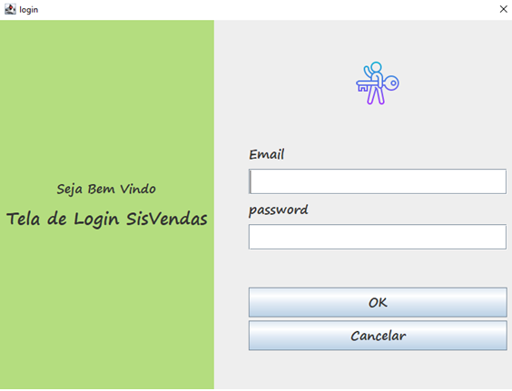

# SisVendas

 
<h>A tela de login do nosso projeto SisVendas é feita com autenticação de usuário usando dois parâmetros, email e senha, que estão cadastradas no banco de dados. A tela abaixo mostra a tela de login que ao ter o botão Ok faz conexão ao banco de dados e caso o usuário seja encontrado mostrará um alerta dizendo que o usuário existe no banco de dados, caso contrário será mostrado um erro.</h>

 
  

 
  

 
  

