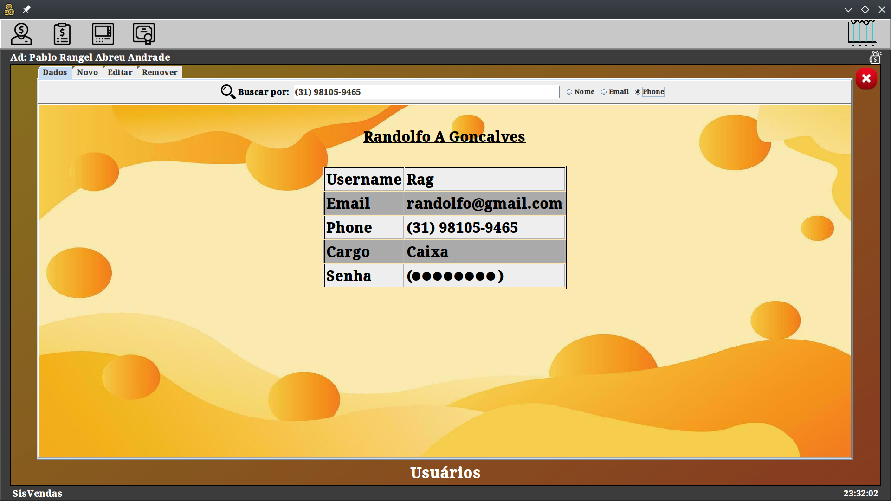
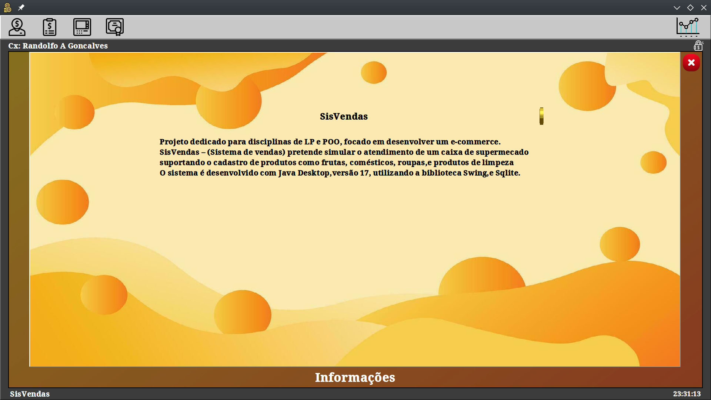
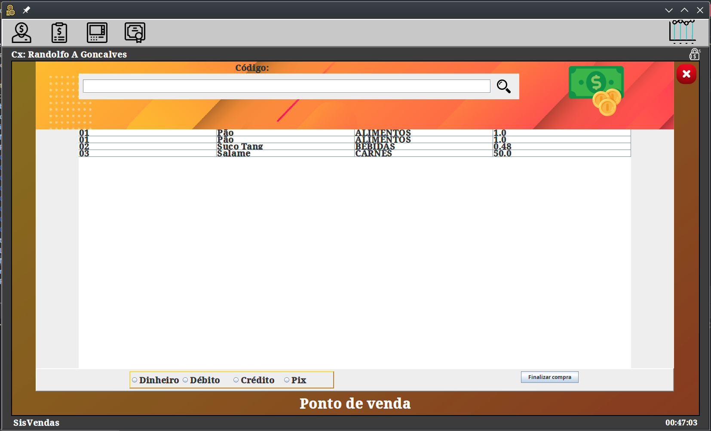
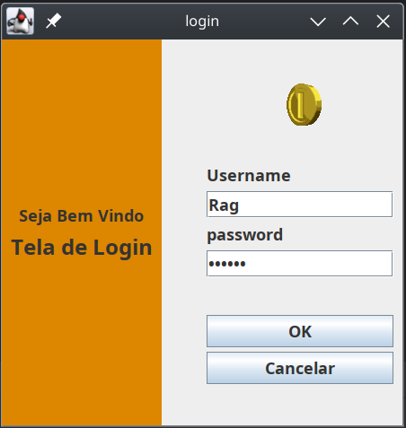
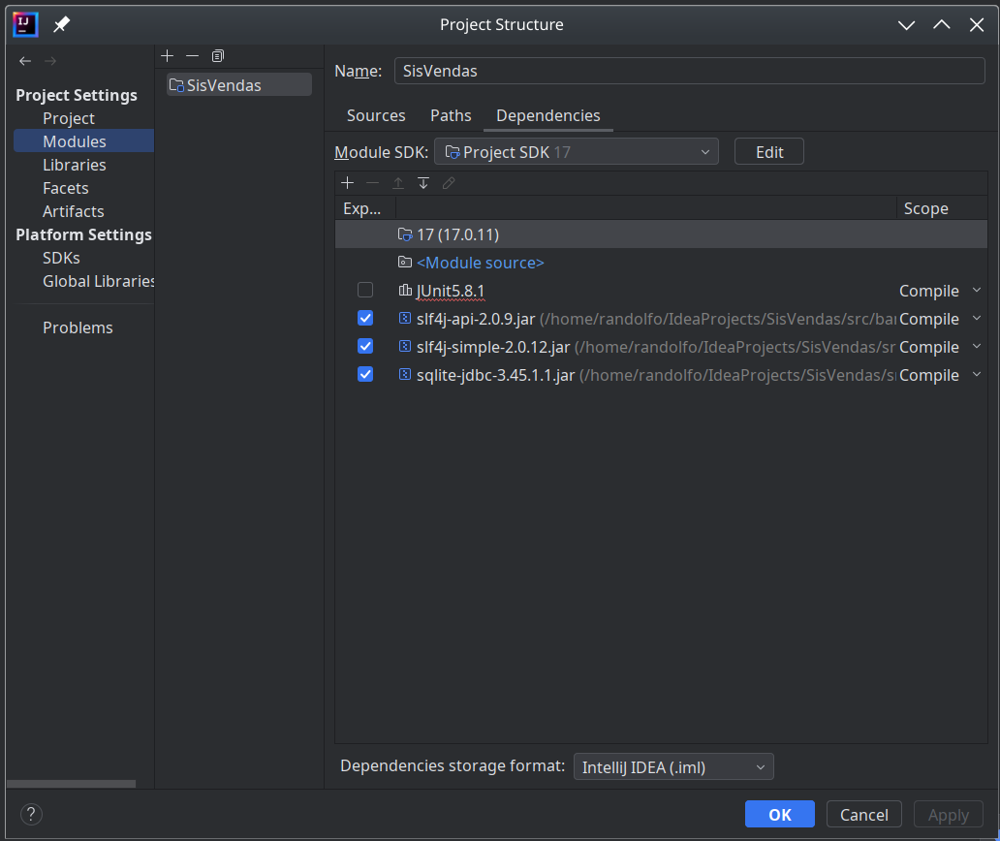
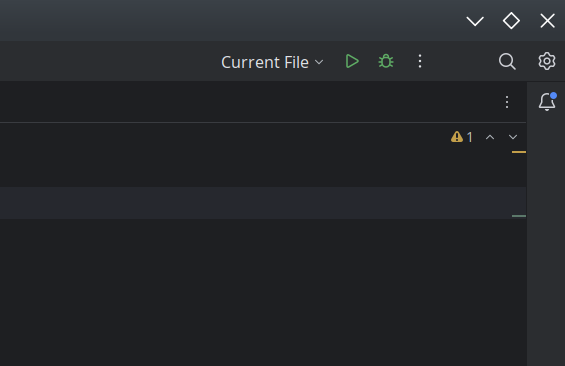

# SisVendas

## Proposta

Sisvendas é projeto simples que visa otimizar e organizar a vida de pequenos empreendedores
oferecendo um ponto de venda(PDV), e um controle de estoque para produtos variados, além de
um sistema hierárquico de acesso, que permite nivelar a interação com o sistema.

## Gestão de recursos

SisVendas oferece uma interface intuitiva para o gerenciamento de produtos e usuários

### Pesquisa por usuário

### Sobre o sistema:

### PDV

### Login

#### Usuários do tipo Administrador possuem total controle sobre o sistema, que implica em cadastrar e modificar produtos e usuários, enquanto os do tipo caixa so podem fazer pesquisas.
_____

## Instalação

### Observação
Este programa foi escrito para ser usado em um ambiente linux, no entanto seu código fonte
se encontra na pasta *src* para outros formatos de compilação, Utilize a plataforma intellij
para simplificar seu ciclo de construção

## Configure dependências:

## Inicie a construção da solução

## Sobre o SisVendas

Projeto dedicado para  disciplinas de LP e POO, focado em desenvolver um e-commerce.
SisVendas – (Sistema de vendas) pretende simular o atendimento de um caixa de supermecado
suportando o cadastro de  produtos como  frutas, comésticos, roupas,e produtos de limpeza
O sistema é desenvolvido com Java Desktop,versão 17, utilizando a biblioteca Swing,e Sqlite.

